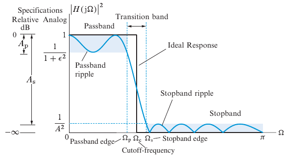

### Butterworth Low-pass Filter Design Tool Class

This Butterworth low-pass filter design tool can be used to design a Butterworth filter in continuous and discrete-time
from the given specifications of the filter performance. The Butterworth filter is a class implementation. A default
constructor creates the object without any argument.

The filter can be prepared in three ways. If the filter specifications are known, such as the pass-band, and stop-band
frequencies (Wp and Ws) together with the pass-band and stop-band ripple magnitudes (Ap and As), one can call the
filter's buttord method with these arguments to obtain the recommended filter order (N) and cut-off frequency
(Wc  [rad/s]).

Figure 1. Butterworth Low-pass filter specification from [1].

An example call is demonstrated below;

    ButterworthFilter bf();

    Wp = 2.0; // passband frequency [rad/sec]
    Ws = 3.0; // stopband frequency [rad/sec]
    Ap = 6.0; // passband ripple mag or loss [dB]
    As = 20.0; // stop band rippe attenuation [dB]
    
    // Computing filter coefficients from the specs
    bf.Buttord(Wp, Ws, Ap, As);

    // Get the computed order and Cut-off frequency
    sOrderCutoff NWc = bf.getOrderCutOff();]
    
    cout << " The computed order is ;" << NWc.N << endl;
    cout << " The computed cut-off frequency is ;" << NWc.Wc << endl;

The filter order and cut-off frequency can be obtained in a struct using bf.getOrderCutoff() method. These specs can be
printed on the screen by calling PrintFilterSpecs() method. If the user would like to define the order and cut-off
frequency manually, the setter methods for these variables can be called to set the filter order (N) and the desired
cut-off frequency (Wc [rad/sec]) for the filter.

#### Obtaining Filter Transfer Functions

The discrete transfer function of the filter requires the roots and gain of the continuous-time transfer function.
Therefore, it is a must to call the first computeContinuousTimeTF() to create the continuous-time transfer function
of the filter using;

    bf.computeContinuousTimeTF();

The computed continuous-time transfer function roots can be printed on the screen using the methods;

    bf.PrintFilter_ContinuousTimeRoots();
    bf.PrintContinuousTimeTF();

The resulting screen output for a 5th order filter is demonstrated below.

     Roots of Continuous Time Filter Transfer Function Denominator are : 
    -0.585518 + j 1.80204
    -1.53291 + j 1.11372
    -1.89478 + j 2.32043e-16
    -1.53291 + j -1.11372
    -0.585518 + j -1.80204
    
    
    The Continuous-Time Transfer Function of the Filter is ;
    
                                       24.422 
    -------------------------------------------------------------------------------
    1.000 *s[5] + 6.132 *s[4] + 18.798 *s[3] + 35.619 *s[2] + 41.711 *s[1] + 24.422 

#### Discrete Time Transfer Function (Difference Equations)

The digital filter equivalent of the continuous-time definitions is produced by using the bi-linear transformation.
When creating the discrete-time function of the ButterworthFilter object, its Numerator (Bn) and Denominator (An
) coefficients are stored in a vector of filter order size N.

The discrete transfer function method is called using ;

    bf.computeDiscreteTimeTF();
    bf.PrintDiscreteTimeTF();

The results are printed on the screen like;
The Discrete-Time Transfer Function of the Filter is ;

    0.191 *z[-5] + 0.956 *z[-4] + 1.913 *z[-3] + 1.913 *z[-2] + 0.956 *z[-1] + 0.191
    --------------------------------------------------------------------------------
    1.000 *z[-5] + 1.885 *z[-4] + 1.888 *z[-3] + 1.014 *z[-2] + 0.298 *z[-1] + 0.037

and the associated difference coefficients An and Bn by withing a struct ;

    sDifferenceAnBn AnBn = bf.getAnBn();

The difference coefficients appear in the filtering equation in the form of.

    An * Y_filtered = Bn * Y_unfiltered  

To filter a signal given in a vector form ;

#### Calling Filter by a specified cut-off and sampling frequencies [in Hz]

The Butterworth filter can also be created by defining the desired order (N), a cut-off frequency (fc in [Hz]), and a
sampling frequency (fs in [Hz]). In this method, the cut-off frequency is pre-warped with respect to the sampling
frequency [1, 2] to match the continuous and digital filter frequencies.

The filter is prepared by the following calling options;

     // 3rd METHOD defining a sampling frequency together with the cut-off fc, fs
     bf.setOrder(2);
     bf.setCuttoffFrequency(10, 100);

At this step, we define a boolean variable whether to use the pre-warping option or not.

    // Compute Continuous Time TF
    bool use_sampling_frequency = true;
    bf.computeContinuousTimeTF(use_sampling_frequency);
    bf.PrintFilter_ContinuousTimeRoots();
    bf.PrintContinuousTimeTF();

    // Compute Discrete Time TF
    bf.computeDiscreteTimeTF(use_sampling_frequency);
    bf.PrintDiscreteTimeTF();

**References:**

1. Manolakis, Dimitris G., and Vinay K. Ingle. Applied digital signal processing: theory and practice. Cambridge
   University Press, 2011.

2. https://en.wikibooks.org/wiki/Digital_Signal_Processing/Bilinear_Transform
 
 
    
