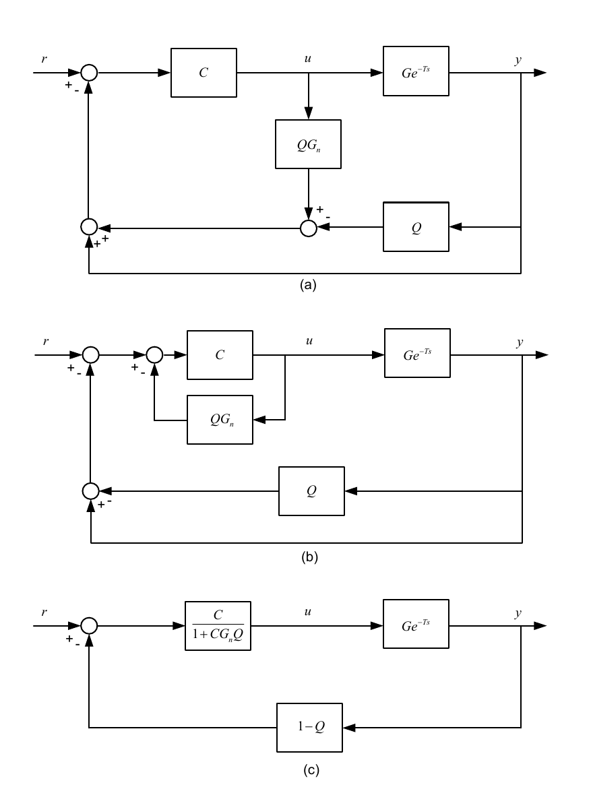

# COMMUNICATION DELAY OBSERVER BASED COMPENSATOR (CDOB) WITH a DISTURBANCE OBSERVER (DOB)

## Theory and Structure

The CDOB and DOB observer-based compensators are intended to mitigate the effects of delayed control and
measurement signals on the system behavior.

Time delay on the signal may cause motion instability or reduce the attainable performance of the controllers. As
such it is essential to alleviate the effects in the practical implementation of the control algorithms.

If the amount of time delay is small, we can design robust controllers that can minimize the effects of the
time delay. However, when the time delay gets more significant, we can do little to design robust controllers. There is
almost no solution other than using the predictive controllers (finite-spectrum assignment) or
time-delay compensators.

The former design methodology requires a good estimation and knowledge of the magnitude of time delays. If the
estimated time delay does not match the real value, or there are time-varying time delays, the time-delay problem may
persist, although we use predictive models.

The CDOB compensators theoretically remove the time delay from the closed-loop system equations allowing to
design controllers as if there no time delay enters any signal channel.

The CDOB approach originates from an assumption that the delay is a disturbance entering from the control channel;

$$
u \rightarrow {e^{-Ts}} \rightarrow u e^{-Ts} = u - d
$$

where $d$ is the time-delay disturbance. The block diagram shown in the figure illustrates the disturbance concept
in which U(s), Gn(s) and exponential term represent the control signal, a controlled system and time-delay.

Figure 1. Disturbance Concept in CDOB [5 by Courtesy of Emirler, M.T] 

This assumption allows us to evaluate the amount of response on system output measurements caused entirely by this
disturbance. This way, we can always feedback the controller with an approximate undelayed response without delay,
preventing the disturbance from entering the control channel.

Figure 2. CDOB Block Diagram [5 by Courtesy of Emirler, M.T]  

Figure 2 depicts the whole CDOB process. This form is primarily employed in theoretical analysis. However, we may
simplify the block diagram, allowing for more flexible implementation. An error signal E(s) is generated from the
reference and system response in the block diagram and fed back to a controller. We can estimate the delayed control
input acting on the system by a system inversion (or an appropriate
disturbance observer). However, inverting a system from a control theory standpoint may not be viable. A Q-filter is
designed to render the inverse transfer function proper to achieve system inversion.

The transfer function of the resulting block diagram is given by

$$
\frac{\mathrm{Y}(\mathrm{s})}{R(s)}=\frac{C G_n e^{-T s}}{1+C G_n Q+C G_n(1-Q) e^{-T s}}
$$

where $Q$ represents a Q-filter which is a low-pass filter and determines the perfomance of the compensation loop.
When the amplitude of Q-filter goes to one, the transfer function of CDOB given above reduces to

$$
\frac{\mathrm{Y}(\mathrm{s})}{R(s)}=\frac{C G_n e^{-T s}}{1+C G_n Q}.
$$

From the implementation perspective, the block diagram given in Figure 2 can be reduced to a form that can make the
implementation easier (Fig. 3.). In this package implementation, we used this block diagram for the CDOB compensator.

Figure 3. Equivalent Block Diagram Transformation [5 by Courtesy of Emirler, M.T] 

### References

1. Natori, K., 2012, March. A design method of time-delay systems with communication disturbance observer by using Pade
   approximation. In 2012 12th IEEE International Workshop on Advanced Motion Control (AMC) (pp. 1-6). IEEE.
2. Zhang, W., Tomizuka, M., Wei, Y.H., Leng, Q., Han, S. and Mok, A.K., 2015, July. Robust time delay compensation in a
   wireless motion control system with double disturbance observers. In 2015 American Control Conference (ACC) (pp.
   5294-5299). IEEE.
3. Wang, H. and Guvenc, L., 2018. Use of Robust DOB/CDOB Compensation to Improve Autonomous
   Vehicle Path Following Performance in the Presence of Model Uncertainty, CAN Bus Delays and External Disturbances
   (No. 2018-01-1086).
4. Zhang, W., Tomizuka, M., Wu, P., Wei, Y.H., Leng, Q., Han, S. and Mok, A.K., 2017. A double disturbance observer
   design for compensation of unknown time delay in a wireless motion control system. IEEE Transactions on Control
   Systems Technology, 26(2), pp.675-683.
5. Emirler, M.T., 2015. Advanced Control Systems for Ground Vehicles (Doctoral dissertation, PhD Thesis, İstanbul
   Technical University, İstanbul, Turkey).
6. Wang, H., 2018. Control system design for autonomous vehicle path
   following and collision avoidance (Doctoral
   dissertation, The Ohio State University).
