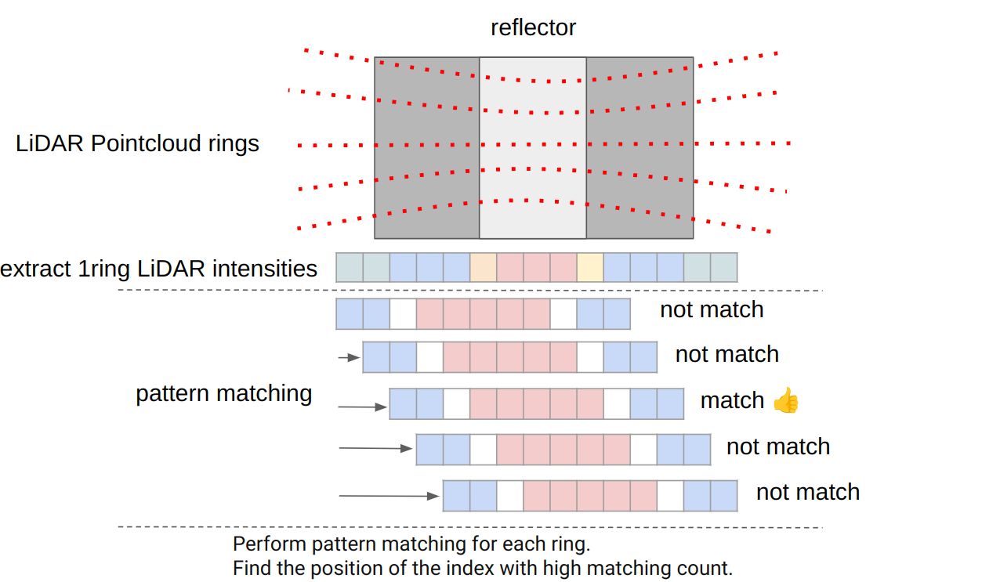

# LiDAR Marker Localizer

**LiDARMarkerLocalizer** is a detect-reflector-based localization node .

## Inputs / Outputs

### `lidar_marker_localizer` node

#### Input

| Name                   | Type                                            | Description      |
| :--------------------- | :---------------------------------------------- | :--------------- |
| `~/input/lanelet2_map` | `autoware_auto_mapping_msgs::msg::HADMapBin`    | Data of lanelet2 |
| `~/input/pointcloud`   | `sensor_msgs::msg::PointCloud2`                 | PointCloud       |
| `~/input/ekf_pose`     | `geometry_msgs::msg::PoseWithCovarianceStamped` | EKF Pose         |

#### Output

| Name                            | Type                                            | Description                                                        |
| :------------------------------ | :---------------------------------------------- | :----------------------------------------------------------------- |
| `~/output/pose_with_covariance` | `geometry_msgs::msg::PoseWithCovarianceStamped` | Estimated pose                                                     |
| `~/debug/pose_with_covariance`  | `geometry_msgs::msg::PoseWithCovarianceStamped` | [debug topic] Estimated pose                                       |
| `~/debug/marker_detected`       | `geometry_msgs::msg::PoseArray`                 | [debug topic] Detected marker poses                                |
| `~/debug/marker_mapped`         | `visualization_msgs::msg::MarkerArray`          | [debug topic] Loaded landmarks to visualize in Rviz as thin boards |
| `/diagnostics`                  | `diagnostic_msgs::msg::DiagnosticArray`         | Diagnostics outputs                                                |

## Parameters

{{ json_to_markdown("localization/landmark_based_localizer/lidar_marker_localizer/schema/lidar_marker_localizer.schema.json") }}

## How to launch

When launching Autoware, set `lidar-marker` for `pose_source`.

```bash
ros2 launch autoware_launch ... \
    pose_source:=lidar-marker \
    ...
```

### Detection Algorithm



1. Split the LiDAR point cloud into rings along the x-axis of the base_link coordinate system at intervals of the `resolution` size.
2. Find the portion of intensity that matches the `intensity_pattern`.
3. Perform steps 1 and 2 for each ring, accumulate the matching indices, and detect portions where the count exceeds the `vote_threshold_for_detect_marker` as markers.

## Sample Dataset

- [Sample rosbag and map](https://drive.google.com/file/d/1FuGKbkWrvL_iKmtb45PO9SZl1vAaJFVG/view?usp=sharing)

This dataset was acquired in National Institute for Land and Infrastructure Management, Full-scale tunnel experiment facility.
The reflectors were installed by [Taisei Corporation](https://www.taisei.co.jp/english/).

## Collaborators

- [TIER IV](https://tier4.jp/en/)
- [Taisei Corporation](https://www.taisei.co.jp/english/)
- [Yuri Shimizu](https://github.com/YuriShimizu824)
