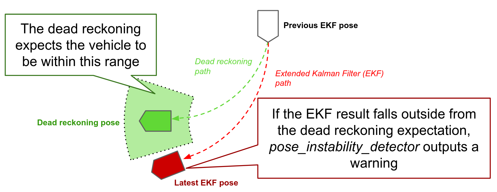
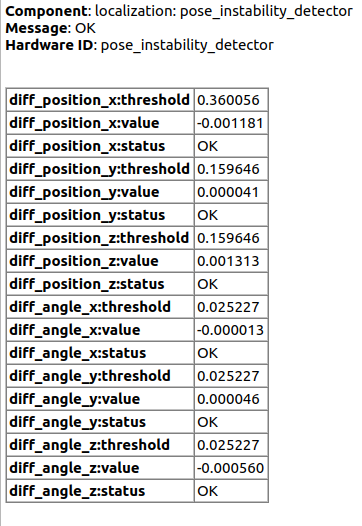

# pose_instability_detector

The `pose_instability_detector` is a node designed to monitor the stability of `/localization/kinematic_state`, which is an output topic of the Extended Kalman Filter (EKF).

This node triggers periodic timer callbacks to compare two poses:

- The pose calculated by dead reckoning starting from the pose of `/localization/kinematic_state` obtained `timer_period` seconds ago.
- The latest pose from `/localization/kinematic_state`.

The results of this comparison are then output to the `/diagnostics` topic.

If this node outputs WARN messages to `/diagnostics`, it means that the EKF output is significantly different from the integrated twist values.
In other words, WARN outputs indicate that the vehicle has moved to a place outside the expected range based on the twist values.
This discrepancy suggests that there may be an issue with either the estimated pose or the input twist.

The following diagram provides an overview of how the procedure looks like:

## Dead reckoning algorithm

Dead reckoning is a method of estimating the position of a vehicle based on its previous position and velocity.
The procedure for dead reckoning is as follows:

1. Capture the necessary twist values from the `/input/twist` topic.
2. Integrate the twist values to calculate the pose transition.
3. Apply the pose transition to the previous pose to obtain the current pose.

### Collecting twist values

The `pose_instability_detector` node collects the twist values from the `~/input/twist` topic to perform dead reckoning.
Ideally, `pose_instability_detector` needs the twist values between the previous pose and the current pose.
Therefore, `pose_instability_detector` snips the twist buffer and apply interpolations and extrapolations to obtain the twist values at the desired time.

### Linear transition and angular transition

After the twist values are collected, the node calculates the linear transition and angular transition based on the twist values and add them to the previous pose.

## Threshold definition

The `pose_instability_detector` node compares the pose calculated by dead reckoning with the latest pose from the EKF output.
These two pose are ideally the same, but in reality, they are not due to the error in the twist values the pose observation.
If these two poses are significantly different so that the absolute value exceeds the threshold, the node outputs a WARN message to the `/diagnostics` topic.
There are six thresholds (x, y, z, roll, pitch, and yaw) to determine whether the poses are significantly different, and these thresholds are determined by the following subsections.

### `diff_position_x`

This threshold examines the difference in the longitudinal axis between the two poses, and check whether the vehicle goes beyond the expected error.
This threshold is a sum of "maximum longitudinal error due to velocity scale factor error", "process error in dead reckoning", and "pose estimation error".

$$
\tau_x = v_{\rm max}\frac{\beta_v}{100} \Delta t + 3\sqrt{N\sigma_v^2\left(\Delta t\right)^2} + \epsilon_x
$$

- $\tau_x \cdots$ Threshold for the difference in the longitudinal axis [m]
- $v_{\rm max} \cdots$ Maximum velocity [m/s]
- $\beta_v \cdots$ Scale factor tolerance for the maximum velocity [%]
- $\Delta t \cdots$ Time interval [s]
- $N \cdots$ Number of integration steps in the dead reckoning
- $\sigma_v^2 \cdots$ Variance of the heading velocity [m/s]
- $\epsilon_x \cdots$ Pose estimator (e. g. ndt_scan_matcher) error tolerance in the longitudinal axis [m]

### `diff_position_y` and `diff_position_z`

These thresholds examine the difference in the lateral and vertical axes between the two poses, and check whether the vehicle goes beyond the expected error.
The `pose_instability_detector` calculates the possible range where the vehicle goes, and get the maximum difference between the nominal dead reckoning pose and the maximum limit pose.

Addition to this, the `pose_instability_detector` node considers the processing noise of the dead reckoning and the pose estimation error to determine the threshold.

$$
\tau_y = l + 3\sqrt{N\left(\sigma_v^2\sigma_\theta^2 + v_{\rm max}^2\sigma_\theta^2 + \omega_{\rm max}^2 \sigma_v^2 \right)\left(\Delta t\right)^2} + \epsilon_y
$$

- $\tau_y \cdots$ Threshold for the difference in the lateral axis [m]
- $l \cdots$ Maximum lateral distance described in the image above [m]
- $\sigma_v^2 \cdots$ Variance of the heading velocity [m/s]
- $\sigma_\theta^2 \cdots$ Variance of the heading angle [rad]
- $v_{\rm max} \cdots$ Maximum heading velocity [m/s]
- $\omega_{\rm max} \cdots$ Maximum angular velocity [rad/s]
- $\Delta t \cdots$ Time interval [s]
- $\epsilon_y \cdots$ Pose estimator (e. g. ndt_scan_matcher) error tolerance in the lateral axis [m]

Note that `pose_instability_detector` sets the threshold for the vertical axis as the same as the lateral axis. Only the pose estimator error tolerance is different.

### `diff_angle_x`, `diff_angle_y`, and `diff_angle_z`

These thresholds examine the difference in the roll, pitch, and yaw angles between the two poses.
This threshold is a sum of "maximum angular error due to velocity scale factor error and bias error", "process error in dead reckoning", and "pose estimation error"

$$
\tau_\phi = \tau_\theta = \tau_\psi = \left(\omega_{\rm max}\frac{\beta_\omega}{100} + b \right) \Delta t + 3\sqrt{N\sigma_\omega^2\left(\Delta t\right)^2} + \epsilon_\psi
$$

- $\tau_\phi, \tau_\theta, \tau_\psi \cdots$ Threshold for the difference in the roll, pitch, and yaw angles
- $\omega_{\rm max} \cdots$ Maximum angular velocity [rad/s]
- $\beta_\omega \cdots$ Scale factor tolerance for the maximum angular velocity [%]
- $b \cdots$ Bias tolerance of the angular velocity [rad/s]
- $\Delta t \cdots$ Time interval [s]
- $\sigma_\omega^2 \cdots$ Variance of the angular velocity [rad/s]
- $\epsilon_\psi \cdots$ Pose estimator (e. g. ndt_scan_matcher) angular error tolerance [rad]

## Parameters

{{ json_to_markdown("localization/pose_instability_detector/schema/pose_instability_detector.schema.json") }}

## Input

| Name               | Type                                           | Description           |
| ------------------ | ---------------------------------------------- | --------------------- |
| `~/input/odometry` | nav_msgs::msg::Odometry                        | Pose estimated by EKF |
| `~/input/twist`    | geometry_msgs::msg::TwistWithCovarianceStamped | Twist                 |

## Output

| Name                | Type                                  | Description |
| ------------------- | ------------------------------------- | ----------- |
| `~/debug/diff_pose` | geometry_msgs::msg::PoseStamped       | diff_pose   |
| `/diagnostics`      | diagnostic_msgs::msg::DiagnosticArray | Diagnostics |

## Appendix

On calculating the maximum lateral distance $l$, the `pose_instability_detector` node will estimate the following poses.

| Pose                            | heading velocity $v$                             | angular velocity $\omega$                                      |
| ------------------------------- | ------------------------------------------------ | -------------------------------------------------------------- |
| Nominal dead reckoning pose     | $v_{\rm max}$                                    | $\omega_{\rm max}$                                             |
| Dead reckoning pose of corner A | $\left(1+\frac{\beta_v}{100}\right) v_{\rm max}$ | $\left(1+\frac{\beta_\omega}{100}\right) \omega_{\rm max} + b$ |
| Dead reckoning pose of corner B | $\left(1-\frac{\beta_v}{100}\right) v_{\rm max}$ | $\left(1+\frac{\beta_\omega}{100}\right) \omega_{\rm max} + b$ |
| Dead reckoning pose of corner C | $\left(1-\frac{\beta_v}{100}\right) v_{\rm max}$ | $\left(1-\frac{\beta_\omega}{100}\right) \omega_{\rm max} - b$ |
| Dead reckoning pose of corner D | $\left(1+\frac{\beta_v}{100}\right) v_{\rm max}$ | $\left(1-\frac{\beta_\omega}{100}\right) \omega_{\rm max} - b$ |

Given a heading velocity $v$ and $\omega$, the 2D theoritical variation seen from the previous pose is calculated as follows:

$$
\left[
    \begin{matrix}
    x\\
    y
    \end{matrix}
\right]
$$
