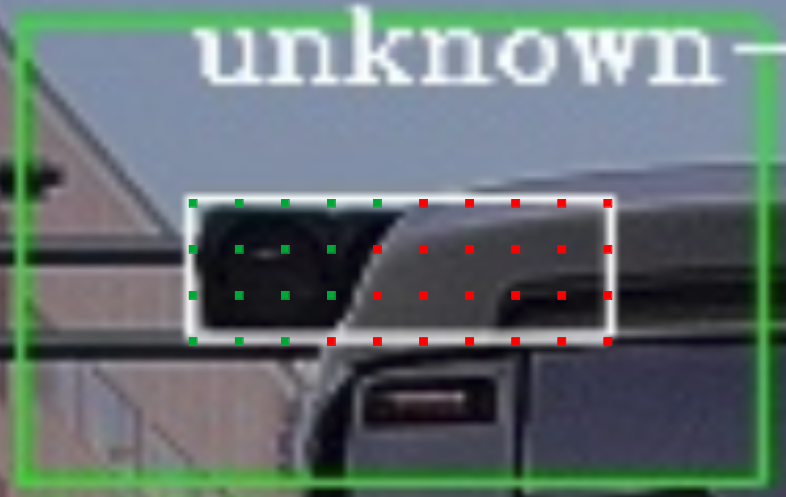

# The `autoware_traffic_light_occlusion_predictor` Package

## Overview

`autoware_traffic_light_occlusion_predictor` receives the detected traffic lights rois and calculates the occlusion ratios of each roi with point cloud.

For each traffic light roi, hundreds of pixels would be selected and projected into the 3D space. Then from the camera point of view, the number of projected pixels that are occluded by the point cloud is counted and used for calculating the occlusion ratio for the roi. As shown in follow image, the red pixels are occluded and the occlusion ratio is the number of red pixels divided by the total pixel numbers.

If no point cloud is received or all point clouds have very large stamp difference with the camera image, the occlusion ratio of each roi would be set as 0. The signal whose occlusion ratio is larger than max_occlusion_ratio will be set as unknown type.

## Input topics

| Name                                 | Type                                                | Description                      |
| ------------------------------------ | --------------------------------------------------- | -------------------------------- |
| `~input/vector_map`                  | autoware_auto_mapping_msgs::HADMapBin               | vector map                       |
| `~/input/car/traffic_signals`        | tier4_perception_msgs::msg::TrafficLightArray       | vehicular traffic light signals  |
| `~/input/pedestrian/traffic_signals` | tier4_perception_msgs::msg::TrafficLightArray       | pedestrian traffic light signals |
| `~/input/rois`                       | autoware_auto_perception_msgs::TrafficLightRoiArray | traffic light detections         |
| `~input/camera_info`                 | sensor_msgs::CameraInfo                             | target camera parameter          |
| `~/input/cloud`                      | sensor_msgs::PointCloud2                            | LiDAR point cloud                |

## Output topics

| Name                       | Type                                          | Description                                                  |
| -------------------------- | --------------------------------------------- | ------------------------------------------------------------ |
| `~/output/traffic_signals` | tier4_perception_msgs::msg::TrafficLightArray | traffic light signals reset according to the occlusion ratio |

## Node parameters

| Parameter                            | Type   | Description                                                   |
| ------------------------------------ | ------ | ------------------------------------------------------------- |
| `azimuth_occlusion_resolution_deg`   | double | azimuth resolution of LiDAR point cloud (degree)              |
| `elevation_occlusion_resolution_deg` | double | elevation resolution of LiDAR point cloud (degree)            |
| `max_valid_pt_dist`                  | double | The points within this distance would be used for calculation |
| `max_image_cloud_delay`              | double | The maximum delay between LiDAR point cloud and camera image  |
| `max_wait_t`                         | double | The maximum time waiting for the LiDAR point cloud            |
| `max_occlusion_ratio`                | int    | The maximum occlusion ratio for setting signal as unknown     |
