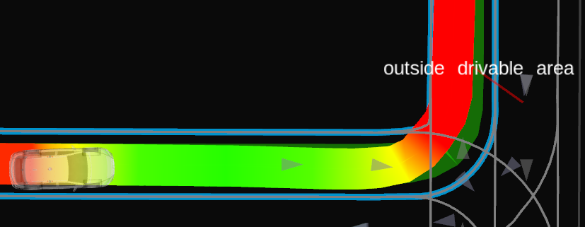
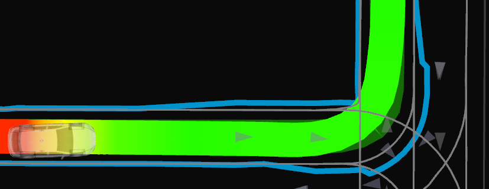

# Drivable Area design

Drivable Area represents the area where ego vehicle can pass.

## Purpose / Role

In order to defined the area that ego vehicle can travel safely, we generate drivable area in behavior path planner module. Our drivable area is represented by two line strings, which are `left_bound` line and `right_bound` line respectively. Both `left_bound` and `right_bound` are created from left and right boundaries of lanelets. Note that `left_bound` and `right bound` are generated by `generateDrivableArea` function.

## Assumption

Our drivable area has several assumptions.

- Drivable Area should have all of the necessary area but should not represent unnecessary area for current behaviors. For example, when ego vehicle is in `follow lane` mode, drivable area should not contain adjacent lanes.

- When generating a drivable area, lanes need to be arranged in the order in which cars pass by (More details can be found in following sections).

- Both left and right bounds should cover the front of the path and the end of the path.

## Limitations

Currently, when clipping left bound or right bound, it can clip the bound more than necessary and the generated path might be conservative.

## Parameters for drivable area generation

### Static expansion

| Name                             | Unit | Type   | Description                                                                | Default value |
| :------------------------------- | :--- | :----- | :------------------------------------------------------------------------- | :------------ |
| drivable_area_right_bound_offset | [m]  | double | right offset length to expand drivable area                                | 5.0           |
| drivable_area_left_bound_offset  | [m]  | double | left offset length to expand drivable area                                 | 5.0           |
| drivable_area_types_to_skip      | [-]  | string | linestring types (as defined in the lanelet map) that will not be expanded | road_border   |

### Dynamic expansion

| Name                                         | Unit  | Type         | Description                                                                                             | Default value                |
| :------------------------------------------- | :---- | :----------- | :------------------------------------------------------------------------------------------------------ | :--------------------------- |
| enabled                                      | [-]   | boolean      | if true, dynamically expand the drivable area based on the path curvature                               | true                         |
| print_runtime                                | [-]   | boolean      | if true, runtime is logged by the node                                                                  | true                         |
| max_expansion_distance                       | [m]   | double       | maximum distance by which the original drivable area can be expanded (no limit if set to 0)             | 0.0                          |
| smoothing.curvature_average_window           | [-]   | int          | window size used for smoothing the curvatures using a moving window average                             | 3                            |
| smoothing.max_bound_rate                     | [m/m] | double       | maximum rate of change of the bound lateral distance over its arc length                                | 1.0                          |
| smoothing.extra_arc_length                   | [m]   | double       | extra arc length where an expansion distance is initially applied                                       | 2.0                          |
| ego.extra_wheel_base                         | [m]   | double       | extra ego wheelbase                                                                                     | 0.0                          |
| ego.extra_front_overhang                     | [m]   | double       | extra ego overhang                                                                                      | 0.5                          |
| ego.extra_width                              | [m]   | double       | extra ego width                                                                                         | 1.0                          |
| dynamic_objects.avoid                        | [-]   | boolean      | if true, the drivable area is not expanded in the predicted path of dynamic objects                     | true                         |
| dynamic_objects.extra_footprint_offset.front | [m]   | double       | extra length to add to the front of the ego footprint                                                   | 0.5                          |
| dynamic_objects.extra_footprint_offset.rear  | [m]   | double       | extra length to add to the rear of the ego footprint                                                    | 0.5                          |
| dynamic_objects.extra_footprint_offset.left  | [m]   | double       | extra length to add to the left of the ego footprint                                                    | 0.5                          |
| dynamic_objects.extra_footprint_offset.right | [m]   | double       | extra length to add to the rear of the ego footprint                                                    | 0.5                          |
| path_preprocessing.max_arc_length            | [m]   | double       | maximum arc length along the path where the ego footprint is projected (0.0 means no limit)             | 100.0                        |
| path_preprocessing.resample_interval         | [m]   | double       | fixed interval between resampled path points (0.0 means path points are directly used)                  | 2.0                          |
| path_preprocessing.reuse_max_deviation       | [m]   | double       | if the path changes by more than this value, the curvatures are recalculated. Otherwise they are reused | 0.5                          |
| avoid_linestring.types                       | [-]   | string array | linestring types in the lanelet maps that will not be crossed when expanding the drivable area          | ["road_border", "curbstone"] |
| avoid_linestring.distance                    | [m]   | double       | distance to keep between the drivable area and the linestrings to avoid                                 | 0.0                          |

## Inner-workings / Algorithms

This section gives details of the generation of the drivable area (`left_bound` and `right_bound`).

### Drivable Lanes Generation

Before generating drivable areas, drivable lanes need to be sorted. Drivable Lanes are selected in each module (`Lane Follow`, `Avoidance`, `Lane Change`, `Goal Planner`, `Pull Out` and etc.), so more details about selection of drivable lanes can be found in each module's document. We use the following structure to define the drivable lanes.

```cpp
struct DrivalbleLanes
{
    lanelet::ConstLanelet right_lanelet; // right most lane
    lanelet::ConstLanelet left_lanelet; // left most lane
    lanelet::ConstLanelets middle_lanelets; // middle lanes
};
```

The image of the sorted drivable lanes is depicted in the following picture.


Note that, the order of drivable lanes become

```cpp
drivable_lanes = {DrivableLane1, DrivableLanes2, DrivableLanes3, DrivableLanes4, DrivableLanes5}
```

### Drivable Area Generation

In this section, a drivable area is created using drivable lanes arranged in the order in which vehicles pass by. We created `left_bound` from left boundary of the leftmost lanelet and `right_bound` from right boundary of the rightmost lanelet. The image of the created drivable area will be the following blue lines. Note that the drivable area is defined in the `Path` and `PathWithLaneId` messages as

```cpp
std::vector<geometry_msgs::msg::Point> left_bound;
std::vector<geometry_msgs::msg::Point> right_bound;
```

and each point of right bound and left bound has a position in the absolute coordinate system.


### Drivable Area Expansion

#### Static Expansion

Each module can statically expand the left and right bounds of the target lanes by the parameter defined values.
This enables large vehicles to pass narrow curve. The image of this process can be described as


Note that we only expand right bound of the rightmost lane and left bound of the leftmost lane.

#### Dynamic Expansion

The drivable area can also be expanded dynamically based on a minimum width calculated from the path curvature and the ego vehicle's properties.

| Without dynamic expansion                                                  | With dynamic expansion                                                   |
| -------------------------------------------------------------------------- | ------------------------------------------------------------------------ |
|  |  |

This expansion can be summarized with the following steps:

##### 1 Calculate and smooth the path curvature

To avoid sudden changes of the expanded drivable area, we first try to reuse as much of the previous path and its calculated curvatures as possible.
Previous path points and curvatures are reused up to the first previous path point that deviates from the new path by more than the `reuse_max_deviation` parameter.
At this stage, the path is also resampled according to the `resampled_interval` and cropped according to the `max_arc_length`.
With the resulting preprocessed path points and previous curvatures, curvatures of the new path points are calculated using the 3 points method and smoothed using a moving window average with window size `curvature_average_window`.

###### 2 For each path point, calculate the closest bound segment and the minimum drivable area width

Each path point is projected on the left and right drivable area bounds to calculate its corresponding bound index, original distance from the bounds, and the projected point.
Additionally, for each path point, the minimum drivable area width is calculated using the following equation:
$$ W = \frac{a² + 2 al + 2kw + l² + w²}{2k + w}$$
Where $W$ is the minimum drivable area width, $a$, is the front overhang of ego, $l$ is the wheelbase of ego, $w$ is the width of ego, and $k$ is the path curvature.
This equation was derived from the work of [Lim, H., Kim, C., and Jo, A., "Model Predictive Control-Based Lateral Control of Autonomous Large-Size Bus on Road with Large Curvature," SAE Technical Paper 2021-01-0099, 2021](https://www.sae.org/publications/technical-papers/content/2021-01-0099/).


###### 3 Calculate maximum expansion distances of each bound point based on dynamic objects and linestring of the vector map (optional)

For each drivable area bound point, we calculate its maximum expansion distance as its distance to the closest "obstacle" (either a map linestring with type `avoid_linestrings.type`, or a dynamic object footprint if `dynamic_objects.avoid` is set to `true`).
If `max_expansion_distance` is not `0.0`, it is use here if smaller than the distance to the closest obstacle.


##### 4 Calculate by how much each bound point should be pushed away from the path

For each bound point, a shift distance is calculated.
such that the resulting width between corresponding left and right bound points is as close as possible to the minimum width calculated in step 2 but the individual shift distance stays bellow the previously calculated maximum expansion distance.


##### 5 Shift bound points by the values calculated in step 4 and remove all loops in the resulting bound

Finally, each bound point is shifted away from the path by the distance calculated in step 4.
Once all points have been shifted, loops are removed from the bound and we obtain our final expanded drivable area.

|                                                                               |                                                                         |
| ----------------------------------------------------------------------------- | ----------------------------------------------------------------------- |
|  |  |

### Visualizing maximum drivable area (Debug)

Sometimes, the developers might get a different result between two maps that may look identical during visual inspection.

For example, in the same area, one can perform avoidance and another cannot. This might be related to the maximum drivable area issues due to the non-compliance vector map design from the user.

To debug the issue, the maximum drivable area boundary can be visualized.


The maximum drivable area can be visualize by adding the marker from `/planning/scenario_planning/lane_driving/behavior_planning/behavior_path_planner/maximum_drivable_area`

#### Expansion with hatched road markings area

If the hatched road markings area is defined in the lanelet map, the area can be used as a drivable area.
Since the area is expressed as a polygon format of Lanelet2, several steps are required for correct expansion.


