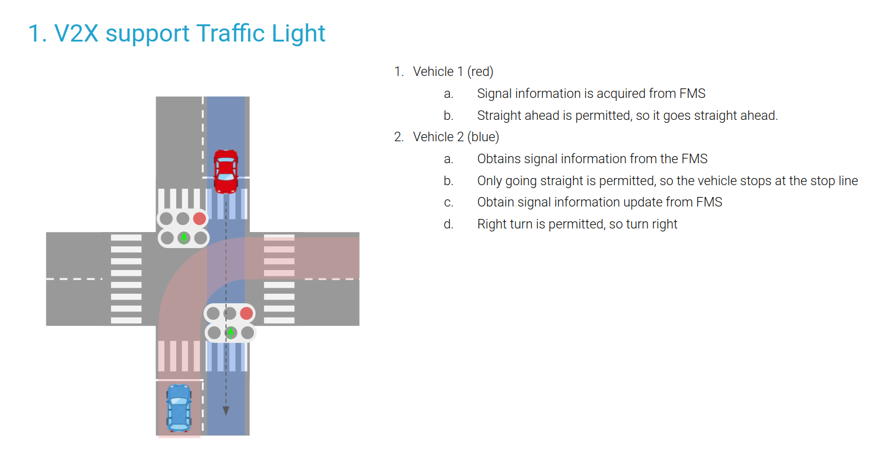
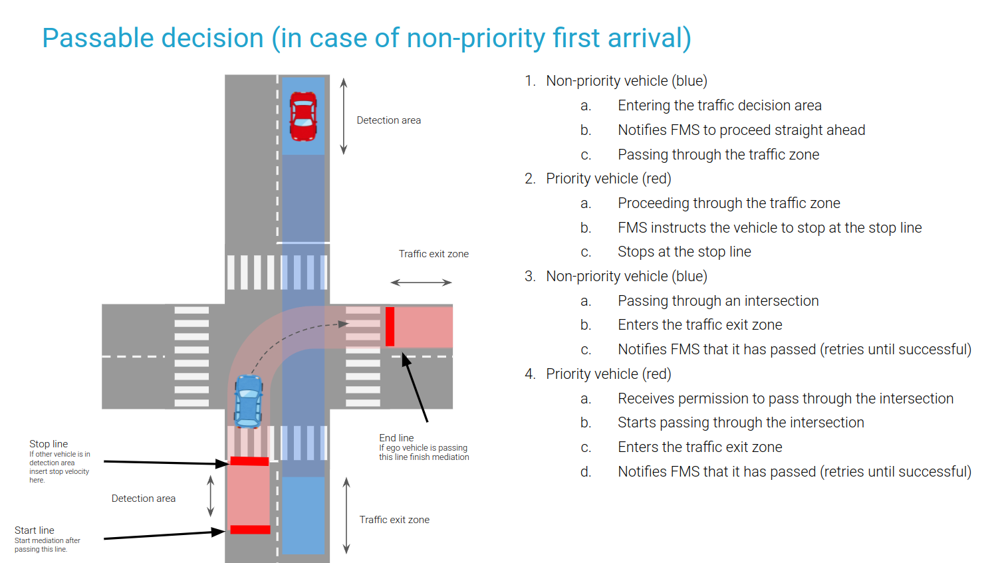

### Virtual Traffic Light

#### Role

Autonomous vehicles have to cooperate with the infrastructures such as:

- Warehouse shutters
- Traffic lights with V2X support
- Communication devices at intersections
- Fleet Management Systems (FMS)

The following items are example cases:

1. Traffic control by traffic lights with V2X support
   

2. Intersection coordination of multiple vehicles by FMS.
   

It's possible to make each function individually, however, the use cases can be generalized with these three elements.

1. `start`: Start a cooperation procedure after the vehicle enters a certain zone.
2. `stop`: Stop at a defined stop line according to the status received from infrastructures.
3. `end`: Finalize the cooperation procedure after the vehicle reaches the exit zone. This should be done within the range of stable communication.

This module sends/receives status from infrastructures and plans the velocity of the cooperation result.

### System Configuration Diagram

```plantuml
@startuml
!theme cerulean-outline

' Component
node "Autoware ECU" as autoware_ecu {
  component "Behavior Planner" as behavior_planner
  component "Autoware API" as autoware_api
  database "Vector Map" as vector_map
  note bottom of vector_map
    Communication metadata is stored.
  end note
}

package "Infrastructures" as infrastructures {
  node "FMS" as fms
  node "Automatic Shutter" as automatic_shutter
  node "Manual Shutter" as manual_shutter
  node "Remove Controllable Traffic Light" as remote_controllable_traffic_light
  node "Warning Light" as warning_light
}

' Relationship
'' Behavior Planner <-> Autoware API
behavior_planner -up-> autoware_api : infrastructure\n command
autoware_api -down-> behavior_planner : infrastructure\n state

'' Vector Map
vector_map -left-> behavior_planner : vector map

'' Autoware API <-> Infrastructure
autoware_api -up-> fms : <color:blue>lock\n <color:blue>request
fms -down-> autoware_api : <color:blue>right-of-way\n <color:blue>state

autoware_api -up-> automatic_shutter : <color:green>approach\n <color:green>notification
automatic_shutter -down-> autoware_api : <color:green>shutter\n <color:green>state

autoware_api -up-> manual_shutter : <color:blue>open/close\n <color:blue>command
manual_shutter -down-> autoware_api : <color:blue>shutter\n <color:blue>state

autoware_api -up-> remote_controllable_traffic_light : <color:green>light change\n <color:green>command
remote_controllable_traffic_light -down-> autoware_api : <color:green>light\n <color:green>state

autoware_api -up-> warning_light : <color:blue>activation\n <color:blue>command
warning_light -down-> autoware_api : <color:blue>warning light\n <color:blue>state

' Layout
'' Infrastructure
fms -[hidden]right-> automatic_shutter
automatic_shutter -[hidden]right-> manual_shutter
manual_shutter -[hidden]right-> remote_controllable_traffic_light
remote_controllable_traffic_light -[hidden]right-> warning_light

@enduml
```

Planner and each infrastructure communicate with each other using common abstracted messages.

- Special handling for each infrastructure is not scalable. The interface is defined as an Autoware API.
- The requirements for each infrastructure are slightly different, but will be handled flexibly.

FMS: Intersection coordination when multiple vehicles are in operation and the relevant lane is occupied

- Automatic shutter: Open the shutter when approaching/close it when leaving
- Manual shutter: Have the driver open and close the shutter.
- Remote control signal: Have the driver change the signal status to match the direction of travel.
- Warning light: Activate the warning light

Support different communication methods for different infrastructures

- HTTP
- Bluetooth
- ZigBee

Have different meta-information for each geographic location

- Associated lane ID
- Hardware ID
- Communication method

FMS: Fleet Management System

```plantuml
@startuml
!theme cerulean-outline

' Component
node "Autoware ECU" as autoware_ecu {
component "Behavior Planner" as behavior_planner
component "Autoware API" as autoware_api
component "Web.Auto Agent" as web_auto_agent
note right of web_auto_agent : (fms_bridge)
database "Vector Map" as vector_map

package "Infrastructure Bridges" as infrastructure_bridges {
  component "Automatic Shutter Bridge" as automatic_shutter_bridge
  component "Manual Shutter Bridge" as manual_shutter_bridge
  component "Remove Controllable Traffic Light Bridge" as remote_controllable_traffic_light_bridge
  component "Warning Light Bridge" as warning_light_bridge
}
}

cloud "FMS" as fms {
  component "FMS Gateway" as fms_gateway

  component "Intersection Arbitrator" as intersection_arbitrator
  database "Intersection Lock Table" as intersection_lock_table

  component "Vector Map Builder" as vector_map_builder
  database "Vector Map Database" as vector_map_database
}

package "Infrastructures" as infrastructures {
  node "Automatic Shutter" as automatic_shutter
  node "Manual Shutter" as manual_shutter
  node "Remote Controllable Traffic Light" as remote_controllable_traffic_light
  node "Warning Light" as warning_light
}

' Relationship
'' Behavior Planner <-> Autoware API
behavior_planner -up-> autoware_api : infrastructure\n command
autoware_api -down-> behavior_planner : infrastructure state\n as virtual traffic light

'' Autoware API <-> Web.Auto
autoware_api -up-> web_auto_agent : infrastructure\n command
web_auto_agent -down-> autoware_api : infrastructure state\n as virtual traffic light

'' Autoware API <-> Infrastructure Bridge
autoware_api -right-> infrastructure_bridges : infrastructure\n command
infrastructure_bridges -left-> autoware_api : infrastructure state\n as virtual traffic light

'' Infrastructure Bridge <-> Infrastructure
automatic_shutter_bridge -right-> automatic_shutter : approach notification
automatic_shutter -left-> automatic_shutter_bridge : shutter state

manual_shutter_bridge -right-> manual_shutter : open/close command
manual_shutter -left-> manual_shutter_bridge : shutter state

remote_controllable_traffic_light_bridge -right-> remote_controllable_traffic_light : light change command
remote_controllable_traffic_light -left-> remote_controllable_traffic_light_bridge : light state

warning_light_bridge -right-> warning_light : activation command
warning_light -left-> warning_light_bridge : warning light state

'' Web.Auto
web_auto_agent -up-> fms_gateway : infrastructure\n command
fms_gateway -down-> web_auto_agent : infrastructure state\n as virtual traffic light

fms_gateway -up-> intersection_arbitrator : lock request
intersection_arbitrator -down-> fms_gateway : right-of-way state

intersection_arbitrator -up-> intersection_lock_table : lock request
intersection_lock_table -down-> intersection_arbitrator : lock result

vector_map_builder -down-> vector_map_database : create vector map
vector_map_database -left-> intersection_arbitrator : vector map

'' Vector Map
vector_map_database .down.> web_auto_agent : vector map
web_auto_agent -left-> vector_map : vector map
vector_map -down-> behavior_planner : vector map

' Layout
'' Infrastructure Bridge
automatic_shutter_bridge -[hidden]down-> manual_shutter_bridge
manual_shutter_bridge -[hidden]down-> remote_controllable_traffic_light_bridge
remote_controllable_traffic_light_bridge -[hidden]down-> warning_light_bridge

'' Infrastructure
automatic_shutter -[hidden]down-> manual_shutter
manual_shutter -[hidden]down-> remote_controllable_traffic_light
remote_controllable_traffic_light -[hidden]down-> warning_light

@enduml
```

#### Module Parameters

| Parameter                       | Type   | Description                                                           |
| ------------------------------- | ------ | --------------------------------------------------------------------- |
| `max_delay_sec`                 | double | [s] maximum allowed delay for command                                 |
| `near_line_distance`            | double | [m] threshold distance to stop line to check ego stop.                |
| `dead_line_margin`              | double | [m] threshold distance that this module continue to insert stop line. |
| `check_timeout_after_stop_line` | bool   | [-] check timeout to stop when linkage is disconnected                |

#### Flowchart

```plantuml
@startuml
!theme cerulean-outline
start

if (before start line?) then (yes)
  stop
else (no)
endif

if (after end line?) then (yes)
  stop
else (no)
endif

:send command to infrastructure;

if (no stop line?) then (yes)
  stop
else (no)
endif

:check infrastructure state;

if (timeout or not received?) then (yes)
  :stop at stop line;
  stop
else (no)
endif

if (no right of way?) then (yes)
  :stop at stop line;
else (no)
endif

if (finalization is requested?) then (yes)
  if (not finalized?) then (yes)
    :stop at end line;
  else (no)
  endif
else (no)
endif

stop
@enduml
```

#### Map Format

- To avoid sudden braking, the length between the start line and stop line of a virtual traffic light must be longer than $l_{\mathrm{min}}$ calculated as follows, assuming that $v_0$ is the velocity when passing the start line and $a_{\mathrm{min}}$ is minimum acceleration defined in Autoware.

$$
\begin{align}
l_{\mathrm{min}} = -\frac{v_0^2}{2 a_{\mathrm{min}}}
\end{align}
$$

#### Known Limits

- tbd.
