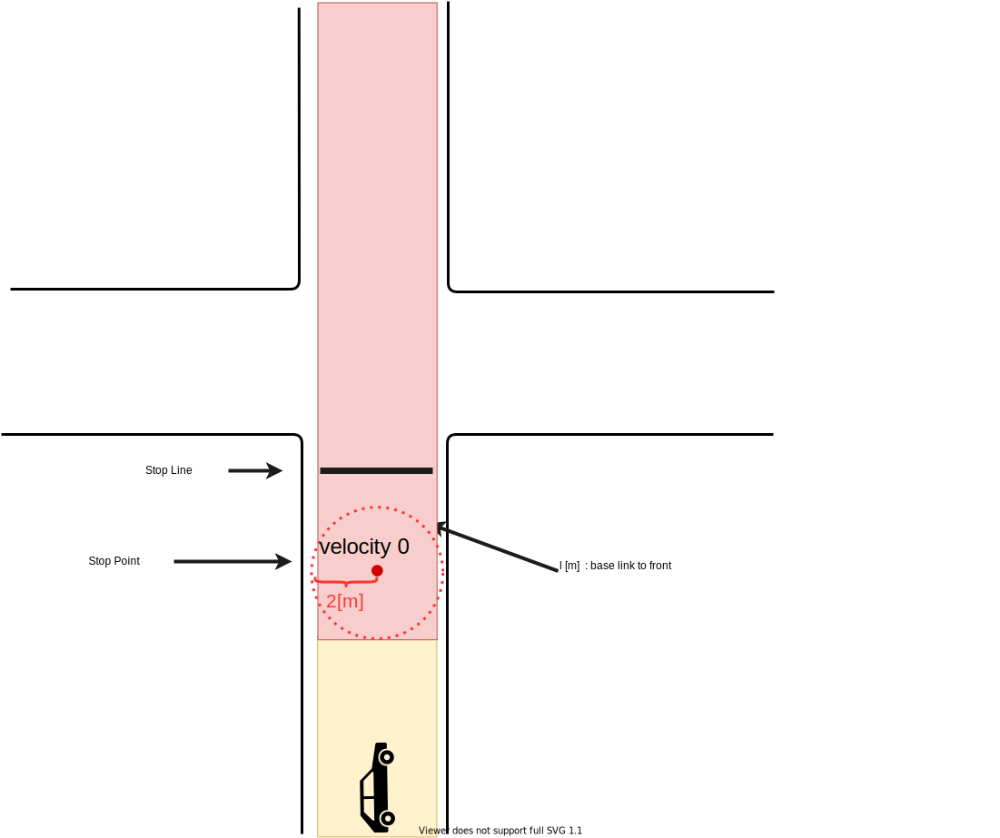
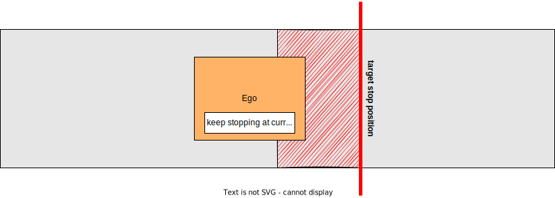

## Stop Line

### Role

This module plans velocity so that the vehicle can stop right before stop lines and restart driving after stopped.

### Activation Timing

This module is activated when there is a stop line in a target lane.

### Module Parameters

| Parameter                        | Type   | Description                                                                                                                                                                       |
| -------------------------------- | ------ | --------------------------------------------------------------------------------------------------------------------------------------------------------------------------------- |
| `stop_margin`                    | double | a margin that the vehicle tries to stop before stop_line                                                                                                                          |
| `stop_duration_sec`              | double | [s] time parameter for the ego vehicle to stop in front of a stop line                                                                                                            |
| `hold_stop_margin_distance`      | double | [m] parameter for restart prevention (See Algorithm section). Also, when the ego vehicle is within this distance from a stop line, the ego state becomes STOPPED from APPROACHING |
| `use_initialization_stop_state`  | bool   | A flag to determine whether to return to the approaching state when the vehicle moves away from a stop line.                                                                      |
| `show_stop_line_collision_check` | bool   | A flag to determine whether to show the debug information of collision check with a stop line                                                                                     |

### Inner-workings / Algorithms

- Gets a stop line from map information.
- insert a stop point on the path from the stop line defined in the map and the ego vehicle length.
- Sets velocities of the path after the stop point to 0[m/s].
- Release the inserted stop velocity when the vehicle stops within a radius of 2[m] from the stop point.

#### Flowchart

```plantuml
@startuml
title modifyPathVelocity
start

:find collision between path and stop_line;

if (collision is found?) then (yes)
else (no)
  stop
endif

:find offset segment;

:calculate stop pose;

:calculate distance to stop line;

if (state is APPROACH) then (yes)
  :set stop velocity;

  if (vehicle is within stop_check_dist?) then (yes)
    if (vehicle is stopped?) then (yes)
      :change state to STOPPED;
    endif
  endif
else if (state is STOPPED) then (yes)
  if (vehicle started to move?) then (yes)
    :change state to START;
  endif
else if (state is START) then (yes)
  if ([optional] far from stop line?) then (yes)
    :change state to APPROACH;
  endif
endif

stop
@enduml
```

This algorithm is based on `segment`.
`segment` consists of two node points. It's useful for removing boundary conditions because if `segment(i)` exists we can assume `node(i)` and `node(i+1)` exist.

First, this algorithm finds a collision between reference path and stop line.
Then, we can get `collision segment` and `collision point`.

Next, based on `collision point`, it finds `offset segment` by iterating backward points up to a specific offset length.
The offset length is `stop_margin`(parameter) + `base_link to front`(to adjust head pose to stop line).
Then, we can get `offset segment` and `offset from segment start`.

After that, we can calculate a offset point from `offset segment` and `offset`. This will be `stop_pose`.

#### Restart prevention

If it needs X meters (e.g. 0.5 meters) to stop once the vehicle starts moving due to the poor vehicle control performance, the vehicle goes over the stopping position that should be strictly observed when the vehicle starts to moving in order to approach the near stop point (e.g. 0.3 meters away).

This module has parameter `hold_stop_margin_distance` in order to prevent from these redundant restart. If the vehicle is stopped within `hold_stop_margin_distance` meters from stop point of the module (\_front_to_stop_line < hold_stop_margin_distance), the module judges that the vehicle has already stopped for the module's stop point and plans to keep stopping current position even if the vehicle is stopped due to other factors.

<figure markdown>
  {width=1000}
  <figcaption>parameters</figcaption>
</figure>

<figure markdown>
  {width=1000}
  <figcaption>outside the hold_stop_margin_distance</figcaption>
</figure>

<figure markdown>
  {width=1000}
  <figcaption>inside the hold_stop_margin_distance</figcaption>
</figure>
