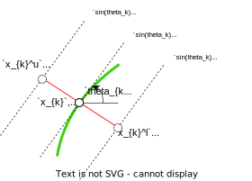

# Elastic band

## Abstract

Elastic band smooths the input path.
Since the latter optimization (model predictive trajectory) uses the curvature and normal vector of the reference path, path smoothing is applied here so that the latter optimization will be stable.

Note that this smoothing process does not consider collision checking.
Therefore the output path may have a collision with road boundaries or obstacles.

## Formulation

We formulate a quadratic problem minimizing the distance between the previous point and the next point on each point.

{width=1000}

Assuming that $k$'th point is $\boldsymbol{p}_k = (x_k, y_k)$, the objective function is as follows.

$$
\begin{align}
\ J & = \min \sum_{k=1}^{n-2} ||(\boldsymbol{p}_{k+1} - \boldsymbol{p}_{k}) - (\boldsymbol{p}_{k} - \boldsymbol{p}_{k-1})||^2 \\
\ & = \min \sum_{k=1}^{n-2} ||\boldsymbol{p}_{k+1} - 2 \boldsymbol{p}_{k} + \boldsymbol{p}_{k-1}||^2 \\
\ & = \min \sum_{k=1}^{n-2} \{(x_{k+1} - x_k + x_{k-1})^2 + (y_{k+1} - y_k + y_{k-1})^2\} \\
\ & = \min
    \begin{pmatrix}
        \ x_0 \\
        \ x_1 \\
        \ x_2 \\
        \vdots \\
        \ x_{n-3}\\
        \ x_{n-2} \\
        \ x_{n-1} \\
        \ y_0 \\
        \ y_1 \\
        \ y_2 \\
        \vdots \\
        \ y_{n-3}\\
        \ y_{n-2} \\
        \ y_{n-1} \\
    \end{pmatrix}^T
    \begin{pmatrix}
      1 & -2 & 1 & 0 & \dots& \\
      -2 & 5 & -4 & 1 & 0 &\dots   \\
      1 & -4 & 6 & -4 & 1 & \\
      0 & 1 & -4 & 6 & -4 &   \\
      \vdots & 0 & \ddots&\ddots& \ddots   \\
      & \vdots & & & \\
      & & & 1 & -4 & 6 & -4 & 1 \\
      & & & & 1 & -4 & 5 & -2 \\
      & & & & & 1 & -2 &  1& \\
      & & & & & & & &1 & -2 & 1 & 0 & \dots& \\
      & & & & & & & &-2 & 5 & -4 & 1 & 0 &\dots   \\
      & & & & & & & &1 & -4 & 6 & -4 & 1 & \\
      & & & & & & & &0 & 1 & -4 & 6 & -4 &   \\
      & & & & & & & &\vdots & 0 & \ddots&\ddots& \ddots   \\
      & & & & & & & & & \vdots & & & \\
      & & & & & & & & & & & 1 & -4 & 6 & -4 & 1 \\
      & & & & & & & & & & & & 1 & -4 & 5 & -2 \\
      & & & & & & & & & & & & & 1 & -2 &  1& \\
    \end{pmatrix}
    \begin{pmatrix}
        \ x_0 \\
        \ x_1 \\
        \ x_2 \\
        \vdots \\
        \ x_{n-3}\\
        \ x_{n-2} \\
        \ x_{n-1} \\
        \ y_0 \\
        \ y_1 \\
        \ y_2 \\
        \vdots \\
        \ y_{n-3}\\
        \ y_{n-2} \\
        \ y_{n-1} \\
    \end{pmatrix}
\end{align}
$$

Regarding the constraint, the distance that each point can move is limited so that the path will not changed a lot but will be smoother.

{width=500}

$$
C_k^l \leq C_k \leq C_k^u
$$

In addition, the beginning point is fixed and the end point as well if the end point is considered as the goal.
Assume that $(x_0^{start}, y_0^{start})$ and $(x_0^{goal}, y_0^{goal})$ are the input start and goal point.

$$
x_0 = x_0^{start} \\
y_0 = y_0^{start}
$$

$$
x_{n-1} = x_{n-1}^{goal} \\
y_{n-1}= y_{n-1}^[goal}
$$
