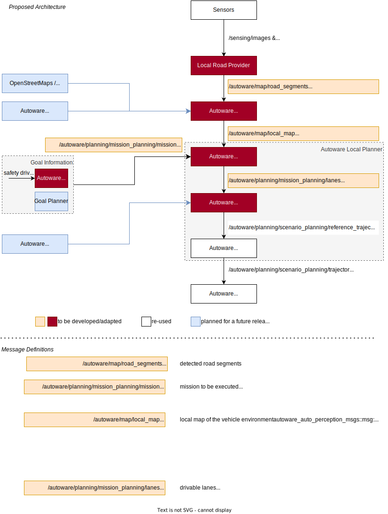

[](https://gitlab.com/driveblocks/mod_mission_planner/-/commits/dev)
[](https://gitlab.com/driveblocks/mod_mission_planner/-/commits/dev)

# Mission Planner

The Mission Planner module generates a reference trajectory/path in a local road model based on mission inputs. These inputs are received from the Human Machine Interface (HMI) or another agent. The resulting trajectory or path is then forwarded to the Behavior Planner for further processing.

A detailed overview can be seen here:



## Components

The Mission Planner consists of several components (ROS2 packages) working together:

- **Local Mission Planner**: Generates target lanes based on the mission input.
- **HMI (Human Machine Interface)**: Provides a user interface for defining missions via terminal input.
- **Converter**: Converts lanes generated by the Mission Planner into Autoware Trajectories/Paths.
- **Local Road Provider**: Converts the LaneletsStamped message into a RoadSegments message.
- **Local Map Provider**: Converts the RoadSegments message into a LocalMap message.

## Launching the Software

To launch all nodes of the software:

```bash
ros2 launch autoware_local_mission_planner mission_planner_compose.launch.py
```

To launch a specific node, such as the mission planner:

```bash
ros2 launch autoware_local_mission_planner mission_planner.launch.py
```

## Additional Notes

During the beta phase, the mission planner will immediately output a straight trajectory with low velocity to move the vehicle into the local road model. Once the vehicle can be located in the local road model, a trajectory following the ego lane will be computed.

## Styleguide

This package adheres to the [Autoware styleguide](https://autowarefoundation.github.io/autoware-documentation/main/contributing/coding-guidelines/languages/cpp/) which can be achieved via [`pre-commit`](https://autowarefoundation.github.io/autoware-documentation/pr-347/contributing/pull-request-guidelines/ci-checks/#pre-commit). Run

```bash
pre-commit run -a
```

to format the code in the Autoware style and check the tests for errors which have to be solved manually.
