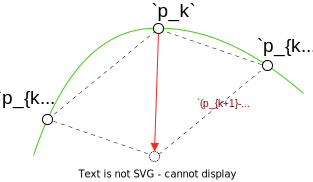
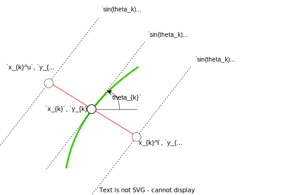
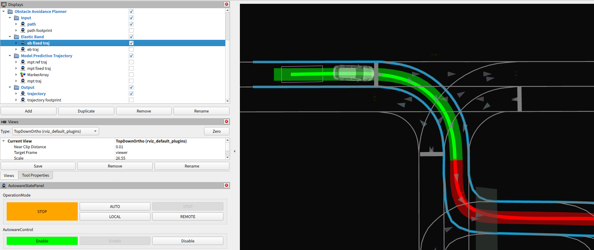

# Elastic band

## Abstract

Elastic band smooths the input path.
Since the latter optimization (model predictive trajectory) is calculated on the frenet frame, path smoothing is applied here so that the latter optimization will be stable.

Note that this smoothing process does not consider collision checking.
Therefore the output path may have a collision with road boundaries or obstacles.

## Flowchart

```plantuml
@startuml
title get_trajectory
start

:crop trajectory;
note right
Forward length is eb.common.num_points * eb.common.delta_arc_length.
Backward length is common.output_backward_traj_length.
end note

:insert_fixed_point;

:resample trajectory;
note right
Resampling interval is eb.common.delta_arc_length.
end note

:get_padded_trajectory_points;
note right
Pad the last optimization point so that the number will be always eb.common.num_points.
This is for enabling warm start.
end note

:update_constraint;

:optimize_trajectory;

:convert_optimized_points_to_trajectory;
note right
The validation function is contained.
When eb.option.enable_optimization_validation is true, the optimization result will be ignored if the validation fails.
end note

stop
@enduml
```

### General parameters

| Parameter                    | Type   | Description                                    |
| ---------------------------- | ------ | ---------------------------------------------- |
| `eb.common.num_points`       | int    | points for elastic band optimization           |
| `eb.common.delta_arc_length` | double | delta arc length for elastic band optimization |

### Parameters for optimization

| Parameter                     | Type   | Description                             |
| ----------------------------- | ------ | --------------------------------------- |
| `eb.option.enable_warm_start` | bool   | flag to use warm start                  |
| `eb.weight.smooth_weight`     | double | weight for smoothing                    |
| `eb.weight.lat_error_weight`  | double | weight for minimizing the lateral error |

### Parameters for validation

| Parameter                                  | Type   | Description                       |
| ------------------------------------------ | ------ | --------------------------------- |
| `eb.option.enable_optimization_validation` | bool   | flag to validate optimization     |
| `eb.validation.max_error`                  | double | max lateral error by optimization |

## Formulation

### Objective function

We formulate a quadratic problem minimizing the diagonal length of the rhombus on each point generated by the current point and its previous and next points, shown as the red vector's length.

{: style="width:600px"}

Assuming that $k$'th point is $\boldsymbol{p}_k = (x_k, y_k)$, the objective function is as follows.

$$
\begin{align}
\ J & = \min \sum_{k=1}^{n-2} ||(\boldsymbol{p}_{k+1} - \boldsymbol{p}_{k}) - (\boldsymbol{p}_{k} - \boldsymbol{p}_{k-1})||^2 \\
\ & = \min \sum_{k=1}^{n-2} ||\boldsymbol{p}_{k+1} - 2 \boldsymbol{p}_{k} + \boldsymbol{p}_{k-1}||^2 \\
\ & = \min \sum_{k=1}^{n-2} \{(x_{k+1} - x_k + x_{k-1})^2 + (y_{k+1} - y_k + y_{k-1})^2\} \\
\ & = \min
    \begin{pmatrix}
        \ x_0 \\
        \ x_1 \\
        \ x_2 \\
        \vdots \\
        \ x_{n-3}\\
        \ x_{n-2} \\
        \ x_{n-1} \\
        \ y_0 \\
        \ y_1 \\
        \ y_2 \\
        \vdots \\
        \ y_{n-3}\\
        \ y_{n-2} \\
        \ y_{n-1} \\
    \end{pmatrix}^T
    \begin{pmatrix}
      1 & -2 & 1 & 0 & \dots& \\
      -2 & 5 & -4 & 1 & 0 &\dots   \\
      1 & -4 & 6 & -4 & 1 & \\
      0 & 1 & -4 & 6 & -4 &   \\
      \vdots & 0 & \ddots&\ddots& \ddots   \\
      & \vdots & & & \\
      & & & 1 & -4 & 6 & -4 & 1 \\
      & & & & 1 & -4 & 5 & -2 \\
      & & & & & 1 & -2 &  1& \\
      & & & & & & & &1 & -2 & 1 & 0 & \dots& \\
      & & & & & & & &-2 & 5 & -4 & 1 & 0 &\dots   \\
      & & & & & & & &1 & -4 & 6 & -4 & 1 & \\
      & & & & & & & &0 & 1 & -4 & 6 & -4 &   \\
      & & & & & & & &\vdots & 0 & \ddots&\ddots& \ddots   \\
      & & & & & & & & & \vdots & & & \\
      & & & & & & & & & & & 1 & -4 & 6 & -4 & 1 \\
      & & & & & & & & & & & & 1 & -4 & 5 & -2 \\
      & & & & & & & & & & & & & 1 & -2 &  1& \\
    \end{pmatrix}
    \begin{pmatrix}
        \ x_0 \\
        \ x_1 \\
        \ x_2 \\
        \vdots \\
        \ x_{n-3}\\
        \ x_{n-2} \\
        \ x_{n-1} \\
        \ y_0 \\
        \ y_1 \\
        \ y_2 \\
        \vdots \\
        \ y_{n-3}\\
        \ y_{n-2} \\
        \ y_{n-1} \\
    \end{pmatrix}
\end{align}
$$

### Constraint

The distance that each point can move is limited so that the path will not changed a lot but will be smoother.
In detail, the longitudinal distance that each point can move is zero, and the lateral distance is parameterized as `eb.clearance.clearance_for_fix`, `eb.clearance.clearance_for_joint` and `eb.clearance.clearance_for_smooth`.

The following figure describes how to constrain the lateral distance to move.
The red line is where the point can move. The points for the upper and lower bound are described as $(x_k^u, y_k^u)$ and $(x_k^l, y_k^l)$, respectively.

{: style="width:700px"}

Based on the line equation whose slope angle is $\theta_k$ and that passes through $(x_k, y_k)$, $(x_k^u, y_k^u)$ and $(x_k^l, y_k^l)$, the lateral constraint is formulated as follows.

$$
C_k^l \leq C_k \leq C_k^u
$$

In addition, the beginning point is fixed and the end point as well if the end point is considered as the goal.
This constraint can be applied with the upper equation by changing the distance that each point can move.

## Debug

- **EB Fixed Trajectory**
  - The fixed trajectory points as a constraint of elastic band.

- **EB Trajectory**
  - The optimized trajectory points by elastic band.

