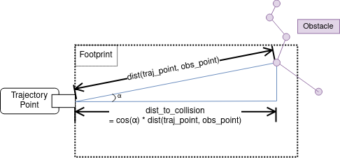

# Safe Velocity Adjustor

## Purpose

This node reduces the velocity of a trajectory around obstacles in order to convey a better feeling of apparent safety to the passengers.

## Inner-workings / Algorithms

Using a parameter `time_safety_buffer`, the feeling of apparent safety is defined as
"no collision with an obstacle even if the vehicle keeps going straight for a duration of `time_safety_buffer`".

In this node, a simple particle model is used to simulated the motion of the ego vehicle at each point of the trajectory.
A corresponding footprint polygon is constructed and checked for collision with obstacles.

If a collision is found, the velocity at the trajectory point is adjusted such that the resulting footprint would no longer collide with an obstacle:
$velocity = \frac{dist\_to\_collision}{time\_safety\_buffer}$

To avoid reducing the velocity too much, a parameter `min_adjusted_velocity`
provides a lower bound on the modified velocity.

Velocities are only modified in trajectory points past the current ego position.
Additionally, parameter `start_distance` is used to adjust how far ahead of ego to start modifying the velocities.

### Obstacle Detection

For efficient collision detection with a footprint, linestrings along obstacles are created from
the occupancy grid using the opencv function
[`findContour`](https://docs.opencv.org/3.4/d3/dc0/group__imgproc__shape.html#ga17ed9f5d79ae97bd4c7cf18403e1689a).

Before being converted to an image, the dynamic obstacles are masked from occupancy grid in order
to avoid incorrectly detecting collision with vehicle moving at velocities higher than parameter `dynamic_obstacles_min_vel`.
Parameter `dynamic_obstacles_buffer` is also used to increase the size of the mask and reduce noise.

After the occupancy grid has been converted to an image, a threshold is applied to only keep cells with a value above parameter `occupancy_grid_obstacle_threshold`.

Contours can then be extracted from the image and corresponding linestrings are created
that can be checked for intersection with the footprint polygon using
[`boost::geometry::intersection`](https://www.boost.org/doc/libs/1_78_0/libs/geometry/doc/html/geometry/reference/algorithms/intersection/intersection_3.html).

## Inputs / Outputs

### Input

| Name                        | Type                                             | Description                              |
| --------------------------- | ------------------------------------------------ | ---------------------------------------- |
| `~/input/trajectory`        | `autoware_auto_planning_msgs/Trajectory`         | Reference trajectory                     |
| `~/input/occupancy_grid`    | `nav_msgs/OccupancyGrid`                         | Occupancy grid with obstacle information |
| `~/input/dynamic_obstacles` | `autoware_auto_perception_msgs/PredictedObjects` | Dynamic objects                          |

### Output

| Name                     | Type                                     | Description                                  |
| ------------------------ | ---------------------------------------- | -------------------------------------------- |
| `~/output/trajectory`    | `autoware_auto_planning_msgs/Trajectory` | Trajectory with adjusted velocities          |
| `~/output/debug_markers` | `visualization_msgs/MarkerArray`         | Debug markers (envelopes, obstacle polygons) |

## Parameters

| Name                                | Type  | Description                                                                                                         |
| ----------------------------------- | ----- | ------------------------------------------------------------------------------------------------------------------- |
| `time_safety_buffer`                | float | [s] required minimum time with no collision at each point of the trajectory assuming constant heading and velocity. |
| `dist_safety_buffer`                | float | [m] required distance buffer with the obstacles.                                                                    |
| `min_adjusted_velocity`             | float | [m/s] limit how much the node can reduce the target velocity.                                                       |
| `start_distance`                    | float | [m] controls from which part of the trajectory (relative to the current ego pose) the velocity is adjusted.         |
| `downsample_factor`                 | int   | trajectory downsampling factor to allow tradeoff between precision and performance.                                 |
| `occupancy_grid_obstacle_threshold` | int   | value in the occupancy grid above which a cell is considered an obstacle.                                           |
| `dynamic_obstacles_buffer`          | float | buffer around dynamic obstacles used when masking an obstacle in order to prevent noise.                            |
| `dynamic_obstacles_min_vel`         | float | velocity above which to mask a dynamic obstacle.                                                                    |

## Assumptions / Known limits

The velocity profile produced by this node is not meant to be a realistic velocity profile
and can contain sudden jumps of velocity with no regard for acceleration and jerk.
This velocity profile should only be used as an upper bound on the actual velocity of the vehicle.

## (Optional) Error detection and handling

The critical case for this node is when an obstacle is falsely detected very close to the trajectory such that
the corresponding safe velocity is calculated to be `0`.

Parameter `min_adjusted_velocity` allow to prevent completely stopping the vehicle in such cases.

## (Optional) Performance characterization

## (Optional) References/External links

## (Optional) Future extensions / Unimplemented parts
