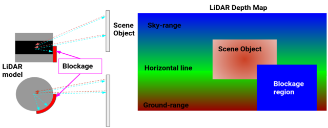

# blockage_diag

## Purpose

To ensure the performance of LiDAR and safety for autonomous driving, the abnormal condition diagnostics feature is
needed.
LiDAR blockage is abnormal condition of LiDAR when some unwanted objects stitch to and block the light pulses and return
signal.
This node's purpose is to detect the existing of blockage on LiDAR and its related size and location.

## Inner-workings / Algorithms(Blockage detection)

This node bases on the no-return region and its location to decide if it is a blockage.

The logic is showed as below

## Inner-workings /Algorithms(Dust detection)

About dust detection, morphological processing is implemented.
If the lidar's ray cannot be acquired due to dust in the lidar area where the point cloud is considered to return from
the ground,
black pixels appear as noise in the depth image.
The area of noise is found by erosion and dilation these black pixels.

## Inputs / Outputs

This implementation inherits `autoware::pointcloud_preprocessor::Filter` class, please refer [README](../README.md).

### Input

| Name                        | Type                            | Description                                                     |
| --------------------------- | ------------------------------- | --------------------------------------------------------------- |
| `~/input/pointcloud_raw_ex` | `sensor_msgs::msg::PointCloud2` | The raw point cloud data is used to detect the no-return region |

### Output

| Name                                                      | Type                                    | Description                                                                                      |
| :-------------------------------------------------------- | :-------------------------------------- | ------------------------------------------------------------------------------------------------ |
| `~/output/blockage_diag/debug/blockage_mask_image`        | `sensor_msgs::msg::Image`               | The mask image of detected blockage                                                              |
| `~/output/blockage_diag/debug/ground_blockage_ratio`      | `autoware_internal_debug_msgs::msg::Float32Stamped` | The area ratio of blockage region in ground region                                               |
| `~/output/blockage_diag/debug/sky_blockage_ratio`         | `autoware_internal_debug_msgs::msg::Float32Stamped` | The area ratio of blockage region in sky region                                                  |
| `~/output/blockage_diag/debug/lidar_depth_map`            | `sensor_msgs::msg::Image`               | The depth map image of input point cloud                                                         |
| `~/output/blockage_diag/debug/single_frame_dust_mask`     | `sensor_msgs::msg::Image`               | The mask image of detected dusty area in latest single frame                                     |
| `~/output/blockage_diag/debug/multi_frame_dust_mask`      | `sensor_msgs::msg::Image`               | The mask image of continuous detected dusty area                                                 |
| `~/output/blockage_diag/debug/blockage_dust_merged_image` | `sensor_msgs::msg::Image`               | The merged image of blockage detection(red) and multi frame dusty area detection(yellow) results |
| `~/output/blockage_diag/debug/ground_dust_ratio`          | `autoware_internal_debug_msgs::msg::Float32Stamped` | The ratio of dusty area divided by area where ray usually returns from the ground.               |

## Parameters

{{ json_to_markdown("sensing/autoware_pointcloud_preprocessor/schema/blockage_diag_node.schema.json") }}

## Assumptions / Known limits

1. Only Hesai Pandar40P and Hesai PandarQT were tested. For a new LiDAR, it is necessary to check order of channel id in
   vertical distribution manually and modify the code.
2. About dusty area detection, False positives occur when there are water puddles on the road surface due to rain, etc.
   Also, the area of the ray to the sky is currently undetectable.

## (Optional) Error detection and handling

## (Optional) Performance characterization

## References/External links

## (Optional) Future extensions / Unimplemented parts
