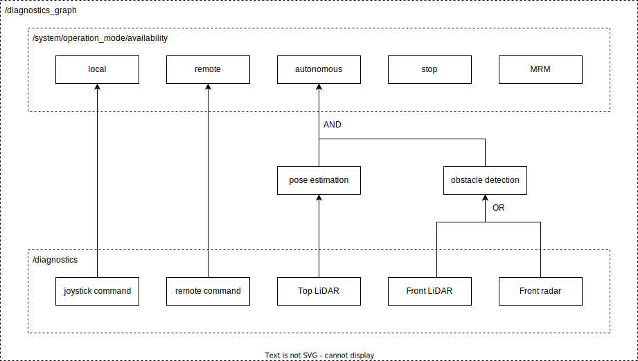

# System diagnostic graph

## Overview

The system diagnostic graph node subscribes to diagnostic status and publishes aggregated diagnostic status.
As shown in the diagram below, this node introduces extra diagnostic status for intermediate functional unit.
Diagnostic status dependencies will be directed acyclic graph (DAG).



## Interface

| Interface Type | Interface Name              | Data Type                               | Description        |
| -------------- | --------------------------- | --------------------------------------- | ------------------ |
| subscription   | `/diagnostics`              | `diagnostic_msgs/msg/DiagnosticArray`   | Input diagnostics. |
| publisher      | `/diagnostics_graph/status` | `diagnostic_msgs/msg/DiagnosticArray`   | Graph status.      |
| publisher      | `/diagnostics_graph/struct` | `tier4_system_msgs/msg/DiagnosticGraph` | Graph structure.   |

## Parameters

| Parameter Name     | Data Type | Description                                |
| ------------------ | --------- | ------------------------------------------ |
| `graph_file`       | `string`  | Path of the config file.                   |
| `rate`             | `double`  | Rate of aggregation and topic publication. |
| `status_qos_depth` | `uint`    | QoS depth of status topic.                 |
| `source_qos_depth` | `uint`    | QoS depth of source topic.                 |

## Graph file format

- [GraphFile](./doc/format/graph-file.md)
- [Path](./doc/format/path.md)
- [Node](./doc/format/node.md)
  - [Diag](./doc/format/diag.md)
  - [Unit](./doc/format/unit.md)
  - [And](./doc/format/and.md)
  - [Or](./doc/format/or.md)

## Example

```bash
ros2 launch system_diagnostic_graph example.launch.xml
```
